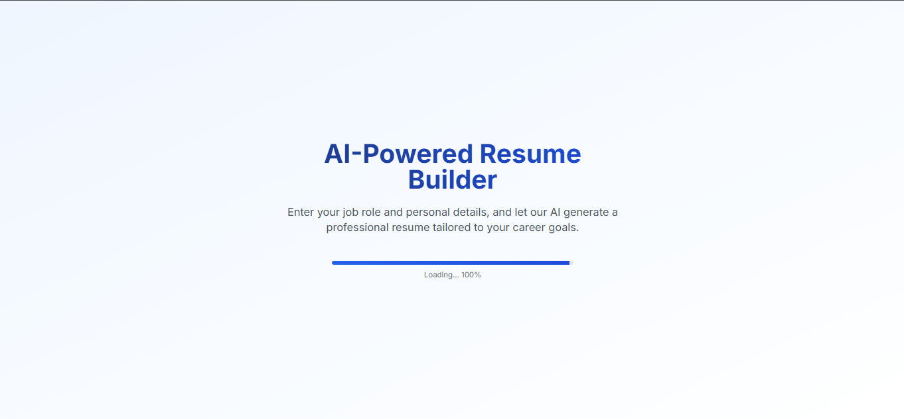

# 🚀 AI Resume Builder

<div align="center">


[](https://opensource.org/licenses/MIT)
[](http://makeapullrequest.com)

</div>

<div align="center">
  
</div>

## ✨ Features

<div align="center">

| 🎨 Design | 🚀 Performance | 🔒 Security |
|:---:|:---:|:---:|
| Multiple Templates | Fast Generation | Secure Auth |
| Custom Themes | Optimized PDFs | Data Privacy |
| Responsive UI | Real-time Preview | API Security |

</div>

### 🌟 Key Features

- 🤖 **AI-Powered Content Generation**
  - Smart resume suggestions
  - Professional content optimization
  - Industry-specific recommendations

- 🎨 **Professional Templates**
  - Modern designs
  - Industry-specific layouts
  - Customizable sections

- 📱 **Responsive Design**
  - Mobile-first approach
  - Cross-device compatibility
  - Print-friendly layouts

- 💾 **Smart Management**
  - Multiple resume versions
  - Auto-save functionality
  - Cloud synchronization

## 🚀 Quick Start

### Prerequisites

```bash
node >= 18.0.0
npm >= 9.0.0
```

### Installation

```bash
# Clone the repository
git clone https://github.com/yourusername/ai-resume-builder.git

# Navigate to project directory
cd ai-resume-builder

# Install dependencies
npm install

# Start development server
npm run dev
```

### Environment Setup

Create a `.env.local` file:

```env
# API Keys
NEXT_PUBLIC_SUPABASE_URL=your_supabase_url
NEXT_PUBLIC_SUPABASE_ANON_KEY=your_supabase_anon_key
OPENAI_API_KEY=your_openai_api_key

# Optional Configurations
NEXT_PUBLIC_APP_URL=http://localhost:3000
```

## 🛠️ Tech Stack

<div align="center">

### Frontend


### Backend


### Tools


</div>

## 📁 Project Structure

```
ai-resume-builder/
├── src/
│   ├── components/          # React components
│   │   ├── ui/             # Reusable UI components
│   │   ├── forms/          # Form components
│   │   └── templates/      # Resume templates
│   ├── lib/                # Utility functions
│   │   ├── supabase.ts     # Supabase client
│   │   └── openai.ts       # OpenAI integration
│   ├── styles/             # Global styles
│   └── types/              # TypeScript definitions
├── public/                 # Static assets
└── ...config files
```

## 🎨 Customization

### Templates
```typescript
// Example template configuration
const template = {
  name: 'Professional',
  sections: ['header', 'experience', 'education'],
  theme: 'modern',
  layout: 'standard'
};
```

### Themes
```typescript
// Example theme configuration
const theme = {
  colors: {
    primary: '#2563eb',
    secondary: '#64748b',
    background: '#ffffff'
  },
  typography: {
    fontFamily: 'Inter',
    fontSize: '16px'
  }
};
```

## 🤝 Contributing

We love your input! We want to make contributing to AI Resume Builder as easy and transparent as possible, whether it's:

- 🐛 Reporting a bug
- 💡 Discussing the current state of the code
- 🔧 Submitting a fix
- ✨ Proposing new features
- 📝 Becoming a maintainer

### Development Process

1. Fork the repo and create your branch from `main`
2. If you've added code that should be tested, add tests
3. If you've changed APIs, update the documentation
4. Ensure the test suite passes
5. Make sure your code lints
6. Issue that pull request!

## 📝 License

By contributing, you agree that your contributions will be licensed under its MIT License.

## 🙏 Acknowledgments

<div align="center">

| Technology | Purpose |
|:---:|:---:|
| [Next.js](https://nextjs.org/) | Frontend Framework |
| [Tailwind CSS](https://tailwindcss.com/) | Styling |
| [OpenAI](https://openai.com/) | AI Integration |
| [Supabase](https://supabase.com/) | Backend & Auth |
| [Shadcn UI](https://ui.shadcn.com/) | UI Components |

</div>

## 📞 Support

<div align="center">

[](https://github.com/yourusername/ai-resume-builder/issues)
[](https://github.com/yourusername/ai-resume-builder/stargazers)
[](https://github.com/yourusername/ai-resume-builder/network/members)

</div>

---

<div align="center">

Made with ❤️ by [Your Name]

[](https://twitter.com/yourusername)
[](https://github.com/yourusername)

</div>